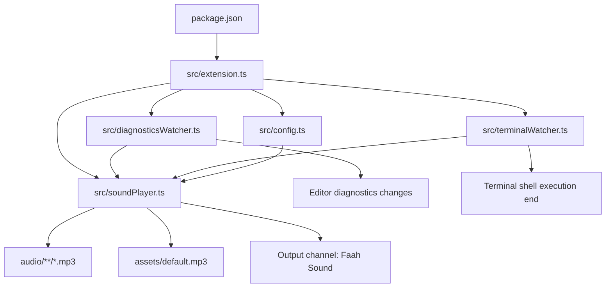

# Faah Faah Error Sound

VS Code extension that plays a funny sound when:

- editor diagnostics get new errors
- a terminal command exits with a non-zero status

## Current behavior

- Windows-first audio playback using built-in PowerShell APIs
- No rate limiting: each matching error trigger plays immediately
- Random MP3 selection from bundled `audio/` folder (including subfolders)
- Command: `Faah Sound: Test Sound`

## Run the extension locally (before publishing)

1. Open this project in VS Code.
2. Install dependencies.
	- Normal: `npm install`
	- If PowerShell blocks npm script execution: `npm.cmd install`
3. Compile TypeScript.
	- Normal: `npm run compile`
	- Alternative: `npm.cmd run compile`
4. Start Extension Development Host.
	- Press `F5` in VS Code.
5. In the new Extension Development Host window, open Output panel and select `Faah Sound`.
	- You should see activation logs.

## Test checklist

### 1) Manual sound test

1. Open Command Palette in Extension Development Host.
2. Run `Faah Sound: Test Sound`.
3. Expected: sound plays immediately.

### 2) Editor diagnostics test

1. Create a file like `test.ts` in Extension Development Host.
2. Paste this code:

```ts
const n: number = "x";
```

3. Expected: as soon as error appears, sound plays.
4. Change it to another error and expected: sound plays again.

### 3) Terminal failure test

1. Open integrated terminal in Extension Development Host.
2. Run a failing command:

```powershell
node -e "process.exit(1)"
```

3. Expected: sound plays.
4. Run a successful command:

```powershell
node -e "process.exit(0)"
```

5. Expected: no sound.

### 4) Random audio test

1. Keep your MP3 files inside `audio/` (subfolders are supported).
2. Run `Faah Sound: Test Sound` multiple times.
3. Expected: different MP3 files are selected randomly.

## Configuration

Set one or more settings in VS Code:

- `faahSound.soundPath`
- `faahSound.editorSoundPath`
- `faahSound.terminalSoundPath`

Each setting can point to either:

- a single MP3 file
- a folder containing MP3 files

Behavior:

- If specific setting paths are valid, extension uses them.
- If no setting path is provided, extension uses bundled `audio/` files.
- If no MP3 is found, extension falls back to beep sound.

## Repository graph



## Optional pre-publish local package test

1. Create VSIX package:
	- `npx @vscode/vsce package`
	- if needed on Windows: `npx.cmd @vscode/vsce package`
2. In normal VS Code, run command `Extensions: Install from VSIX...`
3. Select generated `.vsix` and retest the same checklist above.
